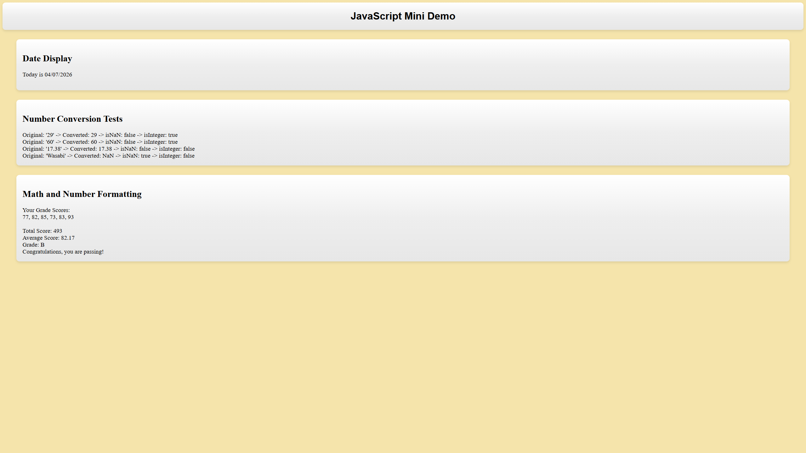

### 1. Built-In Objects and Methods Used:

Date() Object\
Number() Object\
document Object

#### DATE METHODS
.getMonth()\
.getDay()\
.getFullYear()

#### NUMBER METHODS
.isNaN()\
.isInteger()

#### DOCUMENT METHODS
.getElementById()\
.textContent\
.innerHTML

#### OTHER:
.toFixed()

### 2. PAGES LINK

https://pabloxbm.github.io/COMP484_HW9/

### 3. PATH TO IMAGE

### 4. REFLECTION:

The easiest part for me was the Math and Number Formatting as I just had to add numbers and find the average of them since I chose to do option B which was the grade score calculator. The hardest part for me was the date display as I actually had to look into the data object and see how it works. Some things I learned about the 'Date' object were that the numbers for the months don't start at 1, starting at 0, meaning I had to add 1 to get the correct month for the date. I also learned that the data object can get the current date which was pretty cool to play around with. Some things I learned about the 'Number' object were that it could convert strings into numbers and if it can't it returns NaN. We could then test the result of the Number conversion using .isNaN to make sure the variable/string we chose to convert actually converted to a number. Lastly, I learned quite a bit about displaying results in the browser, such as how you can specify an id from an html element to be able to manipulate the contents of it using .getElementById(). I also found out that you could use either .textContent or .innerHTML to change the contents of an html element, with .textContent only changing the direct text and .innerHTML using any html tags like &lt;br&gt; that you specify to format the contents instead of being just pure text.